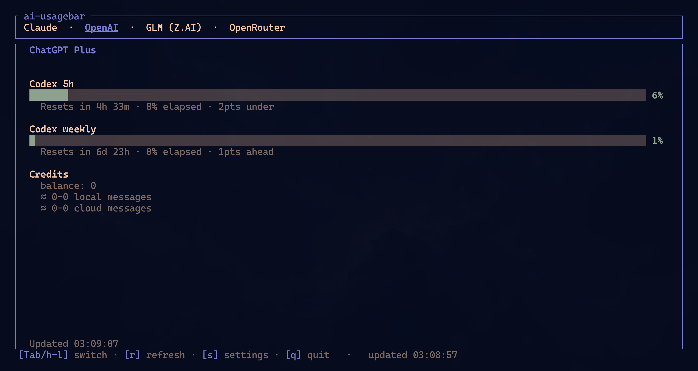
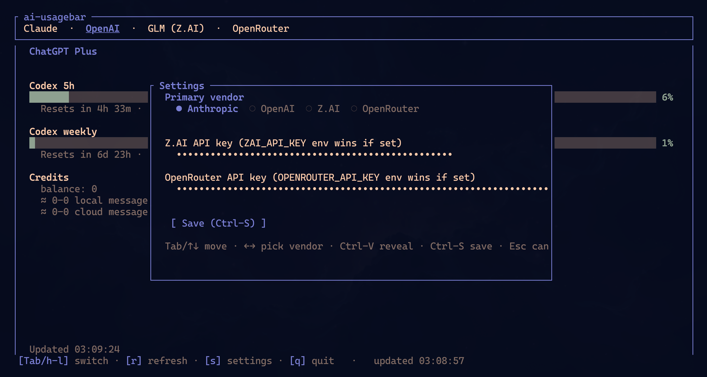

# ai-usagebar

[English](README.md) | 简体中文

Omarchy Quattro 原生面板、Waybar 小组件与多标签 TUI，覆盖 **Claude**、**Codex/ChatGPT**、**Z.AI (GLM)**、**OpenRouter**、**DeepSeek**、**Kimi**、**Nous Research**、**OpenCode Go** 等多家 AI 编程服务的套餐用量。

ai-usagebar 最初是
[`claudebar`](https://github.com/mryll/claudebar) 的 Rust 移植，保持即插即用兼容：保留了 claudebar 的 Pango 悬浮提示、Omarchy 主题探测与 flock 保护的 OAuth 刷新，同时扩展了更多供应商与可测试的 Rust 代码库。


## 功能特性

- **Z.AI / BigModel 企业（团队）订阅密钥**：同一监控端点加 `?type=2` 与组织/项目请求头——按密钥配置计费类型即可，站点（z.ai / bigmodel.cn）自动检测。按量付费密钥自动降级为 7 天用量统计。
- **Z.AI 与 Kimi 多账号**（`[[zai.accounts]]` / `[[kimi.accounts]]`）：每把密钥在任务栏有独立磁贴、在 TUI 有独立标签页、独立缓存——通过原生设置表单（添加/重命名/删除、逐卡 Apply）或在 `config.toml` 中管理。
- **自定义显示名称**：命名账号的任务栏磁贴以你起的名字开头（`kimi-main 42%·2h 15%·2d`）；未命名则显示供应商名（`kimi 37%·2d`）。名字同时是 `--account <label>` 选择器。
- **任务栏逐账号分级配色**：每个磁贴按剩余配额着色——绿色 ≥50%、黄色 <50%、橙色 <10%、红色 <5%——5 小时窗口与周窗口并排显示，各自带重置倒计时（`42%·2h 15%·2d`；未启动的窗口显示 `0%·-`）。
- 每供应商 Waybar 模块使用与 claudebar 相同的 JSON 结构和参数。
- Omarchy Quattro 原生插件跟随 shell 主题，支持键盘导航、供应商切换、实时重置计时器与过期/错误状态。
- `ai-usagebar-omarchy-tui` 启动即显示紧凑的供应商总览，每 60 秒刷新。导航支持侧栏、顶栏或隐藏供应商框。
- 可选的 Claude Code 上下文视图读取近期本地会话用量，不扫描完整历史。
- Omarchy Quattro 原生插件是主前端。
- 一个任务栏项同时平铺所有已启用账号（Waybar 用 `--vendor all`；Omarchy 任务栏原生如此）。`[ui] primary` 控制小组件与 TUI 的初始供应商。
- 原子缓存与文件锁避免多显示器 Waybar 配置的重复请求。
- 网络故障时保留上一次数据可见；HTTP 错误显示在悬浮提示中。
- `--pretty`、`--watch N` 与 `make smoke` 便于本地测试与 API 响应变化排查。

## 参考指南

- [配置参考](docs/configuration.md)
- [Claude 多账号](docs/claude-accounts.md)
- [格式占位符](docs/format-placeholders.md)
- [供应商端点与联调测试](docs/vendor-endpoints.md)

## 安装（Omarchy）

**两步：**

```bash
# 1. 从源码安装 CLI 二进制
cargo install --git https://github.com/KyleLee/ai-usagebar-omarchy

# 2. 安装插件
omarchy plugin add https://github.com/KyleLee/ai-usagebar-omarchy.git --enable
```

还没有 Rust？先从 <https://rustup.rs> 安装——`cargo install` 会把
`ai-usagebar-omarchy` 和 `ai-usagebar-omarchy-tui` 都装进 `~/.cargo/bin`
（确保该目录在会话 PATH 内，Omarchy shell 才能找到二进制）。之后重跑同一命令加
`--force` 即可更新。

可选：隐藏系统自带 Agents 小组件避免重复：

```bash
omarchy plugin disable omarchy.agents
```

完成——任务栏立即平铺所有已配置账号（右键启动 TUI；cargo 已一并安装）。什么都没配置？
点任务栏图标 → 齿轮（`s`）→ **ACCOUNTS** → **Add account** → 选供应商
（Z.AI / Kimi）→ 粘贴 API 密钥（名字已预填，可修改）→ **Apply**。Z.AI 团队密钥
再选 `team` 计费类型并粘贴两个组织 ID；站点（z.ai / bigmodel.cn）按类型自动检测。

左键打开原生 Quattro 面板；中键/滚轮切换供应商。首次运行还会在该路径生成全注释
模板 `~/.config/ai-usagebar-omarchy/config.toml`（权限 0600，生成后不再改写）——
手工编辑与设置表单等效。

用 `omarchy plugin update ai-usagebar-omarchy` /
`omarchy plugin remove ai-usagebar-omarchy` 更新/移除插件。

## 身份认证

Claude 与 Codex 复用官方 CLI 的 OAuth 凭据。其他供应商使用 API 密钥、已有应用
登录或本地服务。API 密钥可来自环境变量或 `config.toml`。

| 供应商 | 方式 | 需要做什么 |
|---|---|---|
| Claude | 来自 `~/.claude/.credentials.json` 或 macOS 登录钥匙串的 OAuth | 运行一次 `claude`。令牌自动刷新。 |
| Anthropic API | 组织管理员密钥 | 用 `ANTHROPIC_ADMIN_KEY` 或 `[anthropic_api] api_key` 启用。推理与 Claude Code 密钥无效。 |
| Codex | OAuth，读取 `~/.codex/auth.json` | 运行一次 `codex login`。令牌自动刷新。 |
| Z.AI | API 密钥（`ZAI_API_KEY` 环境变量或配置 `[zai] api_key`） | 任选其一。团队/企业订阅密钥同样支持：设 `account_type = "team"` 加 `organization_id` + `project_id`（见[配置参考](docs/configuration.md#zai--bigmodel-account-types)）。多把密钥用 `[[zai.accounts]]`。 |
| OpenRouter | API 密钥（`OPENROUTER_API_KEY` 环境变量或配置） | 任选其一。支持命名密钥。 |
| DeepSeek | API 密钥（`DEEPSEEK_API_KEY` 或配置） | 任选其一并启用。 |
| Kimi | 已有 Kimi Code CLI 登录**或** API 密钥（`KIMI_API_KEY` 或配置） | 启用后，用 `kimi` 登录（无需粘贴）或设 API 密钥（存在时优先）。Kimi For Coding 订阅可在 kimi.com/code/console 签发密钥。多个订阅用 `[[kimi.accounts]]`。 |
| Kilo | API 密钥（`KILO_API_KEY` 环境变量或配置） | 任选其一，需启用。团队余额另设 `[kilo] organization_id`；省略则为个人余额。 |
| Novita | API 密钥（`NOVITA_API_KEY` 环境变量或配置） | 任选其一，需启用。 |
| Moonshot | API 密钥（`MOONSHOT_API_KEY` 或配置） | 需启用。区域 `cn` 显示人民币；`global` 用美元。 |
| Grok (xAI) | 管理密钥 | 用 `XAI_MANAGEMENT_KEY` 或配置启用。推理密钥无效。 |
| SuperGrok | 官方 Grok Build ACP 扩展 | 需启用，安装 Grok Build 并运行 `grok login`。显示订阅用量而非 Management API 余额。 |
| MiniMax | Token Plan 订阅密钥 | 用 `MINIMAX_API_KEY` 或配置启用。选择对应 global 或国内区域；按量付费密钥无效。 |
| Google Antigravity | 本地 Antigravity 服务 | 需启用并保持 Antigravity 或交互式 `agy` 会话运行。 |
| Cursor | 已有 Cursor IDE 或 `cursor-agent` 登录 | 需启用并登录一次。`cursor-agent` 为无头回退。 |
| Kiro CLI | 已有 kiro-cli 登录 | 需启用并运行一次 `kiro-cli login`。ai-usagebar-omarchy 按需刷新会话。 |
| Nous Research | OAuth 设备流 | 启用 `[nous]`，在 Omarchy 设置面板点击登录，或运行 `ai-usagebar-omarchy auth nous login`。凭据保存在独立平台配置目录（Linux 为 `~/.config/ai-usagebar-omarchy/credentials.json`）。 |
| OpenCode Go | API 密钥（`OPENCODE_GO_API_KEY` 环境变量或配置） | 启用 `[opencode-go]`，在 Omarchy 设置面板输入密钥或设环境变量。 |

### Nous 额度与 OpenCode Go

Nous 用量百分比只按订阅额度池计算：
`(月度订阅额度 - 订阅剩余额度) / 月度订阅额度`。
充值/购买额度不计入该百分比。当 Portal 上报时，悬浮提示与 TUI 将订阅额度、充值额度
与总可用额度作为独立数值分别显示。

Nous 登录是交互式的（设备码需在浏览器授权）。保持终端开启直至提示登录完成，然后
刷新 Omarchy 面板。登录不读取 Hermes Agent 凭据。Unix 下新建凭据目录权限 `0700`，
凭据与锁文件 `0600`；已存在的当前用户属主配置目录只要不可被组/其他用户写也可用。
Windows 使用平台配置目录与继承的用户访问控制。

OpenCode Go 使用官方用量端点及 `percent` 字段。密钥可通过原生设置面板输入；存储
值经 stdin 传给 Rust 设置命令，绝不进入 QML 命令行参数。缓存条目绑定端点与密钥
单向指纹，切换账号不会复用他人的新鲜或过期用量。

#### Grok：团队级 vs 组织级密钥

余额位于 `/v1/billing/teams/{team}/prepaid/balance`，需要确定团队。**团队级**管理
密钥自动从密钥读取团队。**组织级**密钥的 `scopeId` 是组织 ID 而非团队 ID，无法
提供；此时需显式设置：

```toml
[grok]
team_id = "your-team-id"
```

不设置时，组织级密钥会报出明确说明此情况的错误，而不是悄悄查询错误的 URL。

### 启用供应商

`enabled = true` 使供应商开始拉取。Anthropic API、DeepSeek、Kimi、Kilo、Novita、
Moonshot、Grok、SuperGrok、Antigravity、Cursor、MiniMax 与 Kiro CLI 默认全部
**关闭**，不影响既有安装。两种启用方式：

- 在 Omarchy 面板点齿轮或按 `s`，或运行 `ai-usagebar-omarchy-tui` 后按 `s`。
  保存非空 API 密钥会自动把该供应商的 `enabled` 置为 `true`。清除则删除
  `config.toml` 中的内联密钥。
- 在配置文件的对应供应商小节加 `enabled = true` 与密钥。

主供应商选择器只列出已启用的供应商，未启用的无法设为主供应商。

通过本地登录而非密钥认证的供应商——Cursor、Kiro CLI、SuperGrok、Antigravity，
以及有 Kimi For Coding 订阅的 Kimi——没有可保存的密钥，在 `config.toml` 里设
`enabled = true` 启用。

### 密钥解析顺序（API 密钥类供应商）

对每个 API 密钥供应商，ai-usagebar 按以下顺序检查：

1. `api_key_env` 指定的非空环境变量。
2. 同一配置小节中的内联 `api_key`。
3. 报错并列出两个缺失选项。

### 安全

- 内联密钥保存在 `~/.config/ai-usagebar-omarchy/config.toml`，权限 `600`。
  提交 dotfiles 前先脱敏。环境变量仍是默认方式，可避免密钥落盘。
- Claude 与 Codex 凭据保留在各自官方 CLI 管理的文件中。
- SuperGrok 凭据留在 Grok Build 内部。ai-usagebar 只接收免凭据的账单结果，
  对 auth/config 文件仅做哈希以区分不同登录的缓存。
- Cursor 的 `state.vscdb` 与 `cursor-agent` 回退 `auth.json` 只读。
- kiro-cli 的 `data.sqlite3` 只读。刷新后的凭据写入账号级 `kiro/oauth.json`
  （Unix 权限 `600`）。

#### macOS：钥匙串中的 Claude 凭据

新版 Claude Code 将 OAuth 凭据存入 macOS 登录钥匙串而非
`~/.claude/.credentials.json`。无需设置：ai-usagebar 使用 macOS 的 `security`
工具读取并刷新 `Claude Code-credentials` 条目。

- 默认账号在有凭据文件时仍优先使用文件。
- 每个独立 `CLAUDE_CONFIG_DIR` 登录有自己的
  `Claude Code-credentials-<hash>` 钥匙串条目。
- 命名账号在 macOS 使用对应作用域钥匙串条目，Linux 回退到凭据文件。

## 配置

可选配置文件位于 `~/.config/ai-usagebar-omarchy/config.toml`。
Claude、Codex、Z.AI 与 OpenRouter 默认启用；其他供应商需手动启用。

从改名前的旧目录（`~/.config/ai-usagebar/`）升级？首次运行会把整个目录——配置、
凭据、账号——迁移到新名字（无法 rename 时做保权限复制；绝不删除任何内容），
使本分支与上游项目不再共享状态。迁移失败的配置仍按原位读取。

**零配置即可开始**：首次运行（小组件、TUI、`usage` 或 Omarchy 面板刷新）会在该
路径生成全注释模板——每个小节与字段都有行内说明，权限 0600，除默认值外不启用
任何内容——配置就是填空。文件生成后绝不改写。

最小示例：

```toml
[ui]
primary = "openai"

[kimi]
enabled = true
# api_key = "..."  # 或设置 KIMI_API_KEY
```

完整字段见[配置参考](docs/configuration.md)。

## 快速上手

```bash
# 本地测试——自动检测 TTY，输出人类可读格式。
ai-usagebar                        # 使用 [ui] primary（默认 anthropic）
ai-usagebar --vendor anthropic_api
ai-usagebar --vendor openai
ai-usagebar --vendor zai
ai-usagebar --vendor openrouter
ai-usagebar --vendor deepseek
ai-usagebar --vendor kimi
ai-usagebar --vendor kiro

# 强制 Waybar JSON（例如管道给 jq）。
ai-usagebar --json

# 一次看全部：每个已配置供应商的配额与重置时间，
# 每个命名 Claude 账号一条记录。
ai-usagebar-omarchy usage
ai-usagebar-omarchy usage --json | jq '.entries[] | {id, metrics, sections}'

# 一个任务栏模块平铺所有已启用供应商与账号——每账号一个紧凑磁贴
# （team 42% │ kmi 18% │ cld 5%），悬停查看综合报告。
ai-usagebar --vendor all

# 迭代 --format / --tooltip-format 时的实时预览。
ai-usagebar --vendor openrouter --watch 5

# 带标签页的交互式 TUI。
ai-usagebar-tui
```

JSON 报告对每个供应商提供两个视图：

- `metrics` 只含百分比仪表。
- `sections` 保留完整有序显示，含余额、分组行与间隔行。无百分比的行不编造数值。

报告还包含配置的 `primary` id。每个条目有 `display_name`、`short_name`、
`status`、`stale`、`fetched_at`；指标行可带 `severity` 与绝对 `reset_at`。
这些字段均为增量添加，既有消费方保持兼容。`short_name` 即 `{vendor_short}`
打印的三字母代码，前端要紧凑供应商标签直接从报告取，无需维护自己的表。

## 独立 TUI

`ai-usagebar-omarchy-tui` 与任务栏共用同一个 `cargo install`
（装进同一个 `~/.cargo/bin`）：

```bash
cargo install --git https://github.com/KyleLee/ai-usagebar-omarchy
```

还没有 Rust？先从 <https://rustup.rs> 安装。

TUI 不依赖 Waybar。直接在本地终端、SSH 或 tmux 面板中运行：

```bash
ai-usagebar-omarchy-tui               # 在当前终端打开
```

支持 Kitty、Alacritty、Foot、Ghostty 等终端模拟器。控制与设置悬浮层到处一致；
不需要合成器或窗口管理器集成。

## 原生桌面集成

[Omarchy Quattro 插件](omarchy/README.md)是主前端：逐账号任务栏磁贴与分级配色、
原生设置表单、实时重置倒计时与过期/错误状态——控制与设置细节见其 README。

## Waybar 配置

### 单模块滚动切换（推荐）

用一个任务栏项滚动遍历供应商。点击打开的 TUI 仍能查看全部：

```jsonc
"modules-right": ["custom/aibar", ...],

"custom/aibar": {
    "exec": "ai-usagebar --format '{vendor_short} {session_pct}% · {session_reset}'",
    "return-type": "json",
    "interval": 300,
    "signal": 13,
    "tooltip": true,
    "on-click": "ai-usagebar-tui",
    "on-scroll-up":   "ai-usagebar --cycle-next",
    "on-scroll-down": "ai-usagebar --cycle-prev"
}
```

`{vendor_short}` 用三字母代码标识当前供应商。要一个所有切换供应商共用的格式，
用 `{session_pct}`、`{session_reset}`、`{weekly_pct}`、`{weekly_reset}`。
Cursor 把两个用量池映射到 session 与 weekly 槽位；Kiro 把单一池映射到两者。
[占位符参考](docs/format-placeholders.md)列出全部通用与供应商专属字段。

`signal: 13` 让滚动命令通过 `SIGRTMIN+13` 立即刷新任务栏，不必等下个轮询周期。

[KDE plasmoid](kde-plasmoid/README.md) 在自身设置里有相同手势，且从不读写本节
依赖的状态文件。

如果托盘扩展器紧跟 `custom/aibar`，用量文字可能离图标太近。在 Waybar CSS 加右
内边距：

```css
#custom-aibar {
    padding-right: 18px;
}
```

### 按供应商多模块

想一次看全的话：

```jsonc
"modules-right": ["custom/claude", "custom/openai", "custom/openrouter", "custom/zai", "custom/deepseek", "custom/kimi"],

"custom/claude": {
    "exec": "ai-usagebar --vendor anthropic --icon '󰚩'",
    "return-type": "json",
    "interval": 300,
    "tooltip": true,
    "on-click": "ai-usagebar-tui"
},
"custom/openai": {
    "exec": "ai-usagebar --vendor openai --icon '󱢆'",
    "return-type": "json",
    "interval": 300,
    "tooltip": true
},
"custom/openrouter": {
    "exec": "ai-usagebar --vendor openrouter --icon '󰙺' --format '{or_balance} · {or_used_today}'",
    "return-type": "json",
    "interval": 600,
    "tooltip": true
},
"custom/zai": {
    "exec": "ai-usagebar --vendor zai --icon '󰚩'",
    "return-type": "json",
    "interval": 300,
    "tooltip": true
},
"custom/deepseek": {
    "exec": "ai-usagebar --vendor deepseek --icon '󰧑'",
    "return-type": "json",
    "interval": 600,
    "tooltip": true
},
"custom/kimi": {
    "exec": "ai-usagebar --vendor kimi --icon '󰚩'",
    "return-type": "json",
    "interval": 600,
    "tooltip": true
}
```

> 为什么 300 秒？Anthropic 与 OpenAI Codex 端点未公开文档且在约 300 秒以下限流
> 激进。缓存 TTL 为 60 秒以保证多显示器实例共存，但 Waybar 轮询间隔应保持
> 300 秒。

### 多个 Codex 账号

两个 ChatGPT 订阅、各自登录：

```bash
CODEX_HOME=~/.codex-work codex login
```

```toml
[[openai.accounts]]
label = "work"
codex_auth_path = "~/.codex-work/auth.json"
```

```bash
ai-usagebar --vendor openai --account work
```

每个账号独立缓存、独立刷新。不带 `--account` 时照旧使用默认 `codex_auth_path`
登录。

### 多个 Claude 账号

命名账号显示为独立 TUI 标签页与报告条目。推荐配置方式：

```bash
ai-usagebar-omarchy account add work
ai-usagebar --vendor anthropic --account work
```

macOS 上，同一账号命令还能捕获并切换当前 Claude Desktop 或 CLI 登录。专门的
[Claude 账号指南](docs/claude-accounts.md)涵盖：

- 显式与自动发现的账号；
- 安全的凭据与缓存隔离；
- 个人与工作订阅的 Waybar 模块；
- macOS Desktop 与 CLI 切换、备份与历史冲突。

### 多个 OpenRouter 账号

每把密钥加一条 `[[openrouter.accounts]]`，用
`--vendor openrouter --account <label>` 选择。命名账号在 TUI、原生集成与
`usage` 报告中独立显示。各自独立缓存，一把密钥的新鲜数据不会展示为另一把的。
配置与 Waybar 示例见
[OpenRouter 账号指南](docs/openrouter-accounts.md)。

## Hyprland：TUI 浮动窗口

Hyprland 默认平铺 TUI。要让 `ai-usagebar-omarchy-tui` 像 Omarchy 浮动自家设置
TUI（Wi-Fi/`impala`、音频/`wiremix`、蓝牙/`bluetui`）那样居中浮动打开，把以下
内容加进 `~/.config/hypr/hyprland.conf` 或任意被 source 的 `.conf`（如
`looknfeel.conf`）：

```ini
# ai-usagebar TUI — 浮动 + 居中 + 固定尺寸。omarchy-launch-tui 从二进制
# 文件名设置 app-id，因此 class 为 org.omarchy.ai-usagebar-tui。
# 875x600 与 Omarchy 给自家 floating-window TUI 的尺寸一致。
windowrule = float on, match:class ^(org\.omarchy\.ai-usagebar-tui)$
windowrule = center on, match:class ^(org\.omarchy\.ai-usagebar-tui)$
windowrule = size 875 600, match:class ^(org\.omarchy\.ai-usagebar-tui)$
```

然后 `hyprctl reload`（无需注销）。

> Omarchy 在 `~/.local/share/omarchy/default/hypr/apps/system.conf` 里对一组
> 硬编码 TUI app-id 打 `floating-window` 标签，进而应用
> `float + center + size 875 600`。上面的规则直接设置这些值，无论哪个配置先被
> source，尺寸都确定。如果你用其他方式启动 TUI（如
> `kitty -e ai-usagebar-omarchy-tui`），把 class 正则替换为 `hyprctl clients`
> 报告的你的终端 class。

> Hyprland 0.46+ 使用统一 `windowrule` 关键字与 `match:…` 过滤器。旧的
> `windowrulev2 = …, class:…` 语法在旧版本仍可用但已废弃。当前 Omarchy 与
> Hyprland 请使用上述写法。

## 供应商覆盖

CLI 与 TUI 支持上方认证表中的全部供应商。各原生桌面集成覆盖范围不同。
[供应商端点参考](docs/vendor-endpoints.md)列出每个端点、上报指标、桌面选择器、
稳定性说明与联调测试命令。

运行 `make smoke` 检查真实响应结构。

## 格式占位符

在 `--format` 与 `--tooltip-format` 中使用占位符：

```bash
ai-usagebar --vendor anthropic --format '{session_pct}% · {session_reset}'
ai-usagebar --vendor openrouter --format '${or_balance} remaining'
```

claudebar 共享占位符与全部供应商专属字段见
[格式占位符参考](docs/format-placeholders.md)。

## 本地开发

```bash
ai-usagebar --watch 5                              # 实时迭代 --format
ai-usagebar --vendor openrouter --format '{or_balance} · today {or_used_today}'

make test                                          # 单元 + 集成测试
source ~/.config/zsh/secrets                       # 现有供应商联调测试必需
make smoke                                         # 运行全部 ignored 测试；无密钥的 Kimi 跳过
make clippy                                        # cargo clippy -D warnings
```

## TUI 控制



- `Tab` / `l` / `→` — 下一个标签页
- `Shift+Tab` / `h` / `←` — 上一个标签页
- `r` — 刷新当前标签页
- `R` — 刷新全部标签页
- `s` — 打开设置悬浮层（主供应商 + API 密钥）
- `c` — 打开本地 Claude 上下文会话（需 `[context] enabled = true`）；`v` 切换布局
- `q` / `Esc` / `Ctrl-C` — 退出

TUI 每 60 秒刷新。刷新期间保留当前数值并显示 `↻` 标记。请求失败时，最后的快照
保留在屏幕上并标记为过期。

OpenRouter 对余额、分时段用量与账号层级使用相同布局：


### 本地上下文悬浮层

可选的上下文悬浮层回答与供应商标签页不同的本地问题：近期 Claude Code 会话使用了
多少输入上下文。手动启用、重启 TUI、按 `c`：

```toml
[context]
enabled = true
layout = "full"                          # full | split | bottom（`v` 循环）
# projects_path = "~/.claude/projects"  # 默认值
# context_window_tokens = 200000         # 可选回退分母

# 200K 与 1M 会话并存时，精确模型 id 覆盖回退值。
[context.model_context_window_tokens]
"claude-opus-4-6" = 1000000
```

默认 `full` 布局替换仪表盘主体。按 `v` 循环 `full`、`split`、`bottom` 布局。

- `↑`/`↓` 或 `j`/`k` 选择会话。
- `Enter` 打开其详情仪表。
- `Esc` 返回，`r` 重新扫描。

百分比遵循
[Claude Code 状态栏定义](https://code.claude.com/docs/en/statusline)：
`input_tokens + cache_creation_input_tokens + cache_read_input_tokens`。模型
窗口大小不可信时显示原始 token 数，不猜测百分比。压缩（compaction）后等待下一次
助手响应再计算新值。

读取器对 Claude Code 未公开文档的本地 JSONL 防御性处理：

- 只读最近修改的 100 个顶层会话的有界尾部；
- 忽略损坏记录与 `subagents` 分链；
- 不跟随发现的符号链接；
- 文件系统工作在 UI 线程之外执行。

功能禁用时，`~/.claude/projects` 下的任何内容都不会被读取。上下文选项保留在
TOML 中而不进设置弹窗。

### 设置悬浮层



TUI 打开时按 `s`。悬浮层可以：

- 选择**主供应商**（小组件默认值与 TUI 启动选中项）。用 `←` / `→` 循环。
- 为任意受支持的密钥供应商输入密钥。输入时掩码显示；按 `Ctrl-V` 切换可见性。
  供应商配置的环境变量运行时仍优先；内联密钥是回退。保存非空密钥同时把该供应
  商的 `enabled` 置为 `true`。

悬浮层内快捷键：

- `Tab` / `↑↓` — 字段间移动
- `←` / `→` — 循环主供应商选择（仅在供应商字段）
- `Ctrl-V` — 切换焦点密钥字段的可见性
- `Ctrl-S` — 保存并关闭
- `Esc` — 放弃并关闭

保存通过 `toml_edit` 更新 `~/.config/ai-usagebar-omarchy/config.toml`，保留注释
与无关设置。文件权限设为 `600`。

Omarchy 原生 QML 表单使用相同的 Rust 持久化路径与语义。绝不把已存密钥值加载进
长驻 shell 进程：留空表示不变、清除是显式操作、新值经 stdin 传给二进制。

保存之后：

- TUI 标签页立即重新拉取。
- 配置了 `signal: 13` 的 Waybar 模块通过 `SIGRTMIN+13` 刷新。
- 其他 Waybar 模块在下个间隔刷新。运行 `pkill -SIGUSR2 waybar` 强制全量重载。

## 主题

- 默认 One Dark 配色。
- 自动合并 Omarchy 当前主题
  （`~/.config/omarchy/current/theme/colors.toml`）。
- 单色覆盖：`--color-low`、`--color-mid`、`--color-high`、`--color-critical`
  （兼容 claudebar）。

## 更新日志

见 [CHANGELOG.md](CHANGELOG.md)。每个版本在
<https://github.com/KyleLee/ai-usagebar-omarchy/releases> 有独立页面，含自动
生成的安装片段与校验和。

## 致谢

本仓库 fork 自 **AkitaOnRails** 的
[`ai-usagebar`](https://github.com/akitaonrails/ai-usagebar)——感谢原作者。

Codex 与 Claude OAuth 端点参考来自 mryll 的
[`claudebar`](https://github.com/mryll/claudebar) 与
[`codexbar`](https://github.com/mryll/codexbar)。带边框 Pango 悬浮提示、严重度
配色与配速算法亦来自这两个项目。

Kimi `/coding/v1/usages` 端点参考来自社区配额工具：
[`CodexBar`](https://github.com/steipete/CodexBar)（steipete）、
[`OpenUsage`](https://github.com/robinebers/openusage) 与
[`OmniRoute`](https://github.com/diegosouzapw/OmniRoute)。

## 许可证

MIT。
